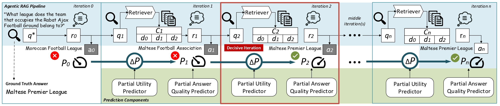
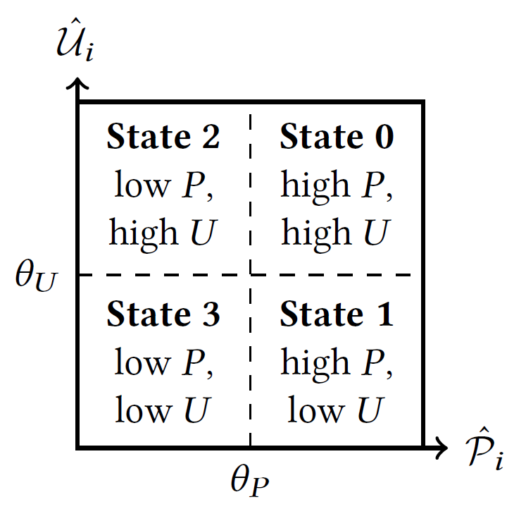

# Predicting Partial Answer Quality and Utility in Agentic Retrieval-Augmented Generation



📄 Code release for the CIKM 2026 paper:

> Fangzheng Tian, Debasis Ganguly, and Craig Macdonald. **Predicting Partial Answer Quality and Utility in Agentic Retrieval-Augmented Generation.** CIKM 2026. DOI: `10.1145/3799682.3840904`.

💻 This repository contains the implementation of the prediction and control components used to study intermediate answer states in agentic retrieval-augmented generation (RAG).

The central idea is to estimate, at each retrieval-reasoning iteration, both:

- **partial answer quality** P<sub>i</sub>: how good the answer is at the current state; and
- **partial utility** U<sub>i</sub> = P<sub>i</sub> - P<sub>i-1</sub>: how much the latest iteration improves the answer.

These estimates can then be used by a lightweight controller to decide whether to continue retrieval and reasoning, stop at the current state, or roll back to an earlier high-quality answer.

## 🔬 Experimental setting

The paper evaluates the approach with **Search-R1** and **R1-Searcher** on **HotpotQA**, **2WikiMultiHopQA**, and **MuSiQue**. The canonical retrieval setup uses E5 dense retrieval with the top three documents from the 2018 Wikipedia corpus.

Using PyTerrier pipeline notation, the canonical Search-R1 configuration is:

```text
E5 % 3 >> SearchR1
```

where `% 3` retains the top three retrieved documents and `>>` passes them to the downstream agentic RAG component.

## 🗂️ Repository structure

```text
.
├── control/
│   ├── joint_controller.py
│   └── prediction_bridge.py
├── predictions/
│   ├── unsupervised/
│   ├── supervised/
│   │   └── prediction_results/
│   └── prediction_head/
│       └── prediction_results/
├── probing/
├── tests/
├── environment.yml
└── README.md
```

### `probing/`

Implements intermediate-answer probing for Search-R1 and R1-Searcher. The probing pipeline produces the confidence signals used by the probing-enhanced prediction setting.

Probe 0 corresponds to the zero-retrieval answer obtained **after the initial reasoning response r<sub>0</sub> and before external retrieval**. See [`probing/README.md`](probing/README.md) for the exact alignment between probes and iteration rows.

### `predictions/unsupervised/`

Implements the training-free signal block used by the prediction head, including QPP, retrieval-overlap, and semantic-similarity features.

### `predictions/supervised/`

Implements the three supervised trajectory-relation regressors:

- adjacent-think (AT);
- long-distance (LD);
- intra-iteration (II).

Each relation predicts both partial answer quality and partial utility, yielding six continuous supervised signals in total.

### `predictions/prediction_head/`

Implements the final lightweight PyTorch MLP prediction head. The camera-ready experiments use hidden layers `(16, 8)` and sequential windows `w ∈ {1, 3, 5}`.

The two controller-oriented feature configurations are:

```text
Unsup. + Sup.         -> unsup_sup
Unsup. + Sup. + Prob. -> unsup_sup_prob
```

Separate heads are trained for `performance` (P<sub>i</sub>) and `utility` (U<sub>i</sub>). Their held-out predictions can be saved under `predictions/prediction_head/prediction_results/` and subsequently consumed by the controller.

### `control/`

Contains the four-state joint quality-utility controller described in the paper. It operates on predicted P<sub>i</sub> and U<sub>i</sub> values and decides whether to continue, stop immediately, or roll back to an earlier high-quality state.



The controller implementation follows the Section 4 decision rule and is a reconstruction of that policy.

## ⚙️ Environment

A concise Conda environment is provided in [`environment.yml`](environment.yml):

```bash
conda env create -f environment.yml
conda activate agentic-rag-prediction
```

The release uses Python 3.11 and the PyTorch, Hugging Face, SentenceTransformers, and PyTerrier ecosystems. Dense retrieval requires FAISS and the Terrier sparse-index components require Java.

## ♻️ Reproduction workflow

The commands below reproduce the main prediction pipeline used in the paper.
They assume that the Search-R1 or R1-Searcher trajectory and retrieval CSVs
have already been generated.

### 1. Compute unsupervised signals

```bash
python -m predictions.unsupervised.compute_features \
    --generation-csv <TRAJECTORY_CSV> \
    --retrieval-csv <RETRIEVAL_CSV> \
    --original-retrieval-csv <ORIGINAL_QUERY_RETRIEVAL_CSV> \
    --rag-model r1 \
    --sparse-index <SPARSE_INDEX> \
    --dense-index <E5_INDEX> \
    --output-csv <UNSUPERVISED_FEATURES_CSV>

### 2. Compute supervised prediction signals

python -m predictions.supervised.predict \
    --relation intra_iteration \
    --target performance \
    --data-csv <TRAJECTORY_FEATURE_CSV> \
    --checkpoint predictions/supervised/checkpoints/performance/intra_iteration/checkpoint.pt \
    --output predictions/supervised/prediction_results/intra_iteration_performance.csv

### 3. Train the prediction head and obtrain P_i and U_i predictions

python -m predictions.prediction_head.train \
    --input-csv <MERGED_FEATURES_CSV> \
    --target performance \
    --window-size 3 \
    --signal-groups unsupervised supervised \
    --save-output

python -m predictions.prediction_head.train \
    --input-csv <MERGED_FEATURES_CSV> \
    --target utility \
    --window-size 3 \
    --signal-groups unsupervised supervised \
    --save-output

### 4. Apply prediction in the joint early-stopping control

python -m control.joint_controller \
    --performance-csv <PERFORMANCE_PREDICTIONS> \
    --utility-csv <UTILITY_PREDICTIONS> \
    --quality-threshold <THETA_P> \
    --utility-threshold <THETA_U> \
    --output-csv <CONTROL_DECISIONS_CSV>

## Data and large experimental artifacts

Large trajectory dumps, retrieval results, dense/sparse indices, model checkpoints, probing outputs, and full precomputed feature caches are **not stored in this GitHub repository**. They are substantially larger than the source code and were produced on cluster infrastructure.

The repository provides the code and schemas needed to regenerate the prediction signals from compatible trajectory/retrieval CSV files. The result directories under `predictions/supervised/prediction_results/` and `predictions/prediction_head/prediction_results/` contain tracked README placeholders, while generated CSV outputs inside them are ignored by Git.

## Repository scope

The repository covers the methodology reported in the camera-ready paper: unsupervised and supervised trajectory signals, optional probing features, the MLP prediction head, and the joint controller.

## 🧪 Tests

Lightweight tests are provided under `tests/`. In particular, the controller tests verify the four-state early-stopping logic independently of retrieval, probing, or prediction-head training.

## 📚 Citation

If you use this repository, please cite:

```bibtex
@inproceedings{agenticRAGpredictions,
  title     = {Predicting Partial Answer Quality and Utility in Agentic Retrieval-Augmented Generation},
  author    = {Tian, Fangzheng and Ganguly, Debasis and Macdonald, Craig},
  booktitle = {Proceedings of the 35th ACM International Conference on Information and Knowledge Management},
  year      = {2026},
  doi       = {10.1145/3799682.3840904}
}
```
